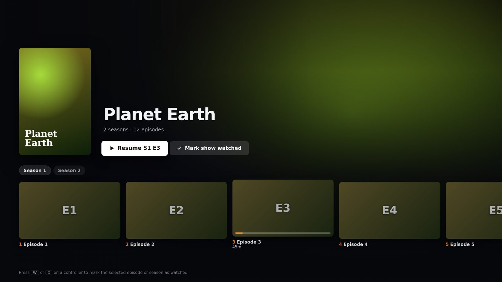
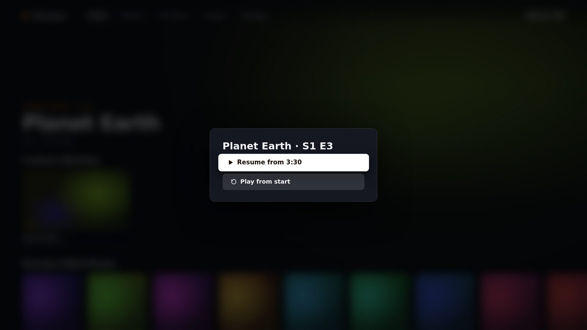
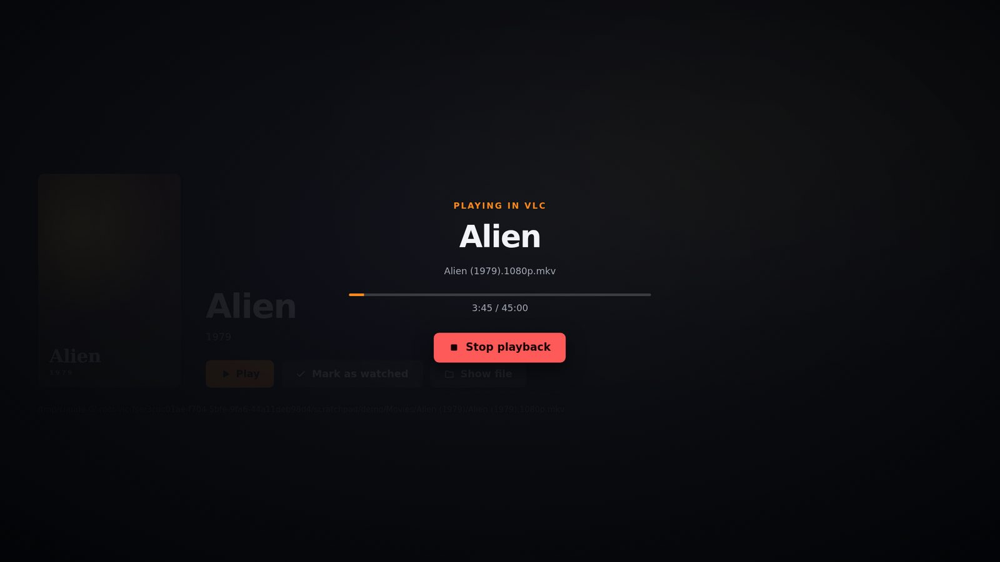

# Marquee

A fullscreen, 10-foot launcher for your films and TV shows on Windows. Marquee turns your media folders into a
browsable library you can drive from the sofa with a remote, keyboard or game controller, and plays everything
in **VLC**.


## Features

- **Fullscreen, TV-style interface.** Large type, cinematic backdrops, and a layout that scales from a 1080p
  monitor to a 4K TV. The text size is adjustable in Settings.
- **Remote, keyboard and gamepad navigation.** Arrow keys or a d-pad move focus spatially, Enter or A
  selects, and Esc, Backspace or B goes back. The mouse works too.
- **Movies and TV shows.** Scene-style names (`The.Matrix.1999.1080p.mkv`, `Show.S02E05.mkv`, `4x07`),
  `Title (Year)` folders and `Season N` folders are all recognised. Local artwork (`poster.jpg`,
  `folder.jpg`, `fanart.jpg`, `<file>-poster.jpg`, …) is used automatically.
- **Resume and watched tracking.** Marquee reads VLC's position while you watch, so you can resume from
  where you stopped. Anything played past 90% is marked as watched.
- **Continue Watching and Next Up.** The home screen shows part-watched films and the next episode of each
  show you're following.
- **Binge mode.** Picking an episode queues the rest of the series in VLC.
- **Optional online artwork.** Add a free [TMDB](https://www.themoviedb.org/settings/api) API key to get
  posters, backdrops, synopses, ratings and episode names. They're cached locally, so browsing works
  offline afterwards.
- **Living-room friendly.** It can start with Windows, keeps the display awake during playback, and returns
  to the front when VLC closes.

| TV show | Resume prompt | While VLC is playing |
| --- | --- | --- |
|  |  |  |

## Install

1. Install [VLC](https://www.videolan.org/vlc/). Marquee finds it through the registry or the usual
   Program Files paths. You can also set its location in Settings.
2. Get Marquee from the [Releases](../../releases) page, or from the artifacts of the latest
   [Build](../../actions/workflows/build.yml) run:
   - **Zip (no installer):** download `Marquee-x.y.z-win-x64.zip`, extract it anywhere (for example
     `C:\Program Files\Marquee` or `C:\Users\<you>\Apps\Marquee`), then run `Marquee.exe`. You can
     right-click `Marquee.exe` and choose *Pin to Start* or *Send to → Desktop* to make a shortcut. To
     uninstall, delete the folder.
   - **Installer:** run `Marquee-Setup-x.y.z.exe`. It adds Start menu and desktop shortcuts and an
     uninstaller.

   The app isn't code-signed, so Windows SmartScreen may warn the first time. Choose *More info → Run
   anyway*.
3. Launch Marquee and add your movies and TV folders.

### Recommended folder layout

```
Movies\
  Heat (1995)\Heat (1995).mkv
  Heat (1995)\poster.jpg          ← optional
  Heat (1995)\fanart.jpg          ← optional
TV\
  Dark (2017)\poster.jpg          ← optional
  Dark (2017)\Season 1\Dark.S01E01.mkv
  Dark (2017)\Specials\Dark.S00E01.mkv
```

Loose files work too. `Extras`, `Featurettes`, `Trailers` and `Sample` folders are ignored.

## Controls

| Action | Keyboard / remote | Xbox-style controller |
| --- | --- | --- |
| Move | Arrow keys | D-pad / left stick |
| Select | Enter | A |
| Back | Esc / Backspace / Browser Back | B |
| Toggle watched | W | X |
| Search | `/` or Ctrl+F | Y |
| Settings | — | Start |
| Previous / next tab | — | LB / RB |
| Rescan library | F5 | — |
| Toggle fullscreen | F11 | — |

## How playback works

Marquee launches VLC with its local web interface bound to `127.0.0.1` on a random port, protected by a
random one-off password. It passes `--fullscreen --play-and-exit`, plus a per-item `:start-time` when you
resume. While VLC runs, Marquee polls `/requests/status.json` every 1.5 seconds to save your position. When
VLC exits, Marquee comes back to the front. Anything you put in **Settings → Extra VLC options** (for
example `--sub-language=eng`) is passed through unchanged.

## Development

```sh
npm install
npm start          # run the app
npm test           # unit tests (parser, scanner, VLC args, metadata)
npm run dist       # build the installer + zip into dist/ (run on Windows)
```

The code is plain JavaScript with no bundler:

- `main.js`: the Electron main process. It handles the window, IPC, the library view model, playback
  sessions and progress.
- `src/parse.js`: filename parsing for movies, episodes, seasons and shows.
- `src/library.js`: folder scanning and local artwork discovery.
- `src/vlc.js`: finding VLC, building its command line, and polling its HTTP interface.
- `src/metadata.js`: optional TMDB lookups with an image cache.
- `renderer/`: the UI. `nav.js` handles spatial and gamepad navigation, and `app.js` holds the views.

Settings, the library cache, watch progress and downloaded artwork are stored in
`%APPDATA%\Marquee`.

### Releases

CI (`.github/workflows/build.yml`) runs on a Windows runner for every push and pull request. It runs the
tests, then builds the zip and the installer and uploads them as workflow artifacts. To publish a release,
push a version tag:

```sh
git tag v1.0.0
git push origin v1.0.0
```

The workflow stamps that version into the build and creates a GitHub Release with
`Marquee-1.0.0-win-x64.zip` and `Marquee-Setup-1.0.0.exe` attached.
