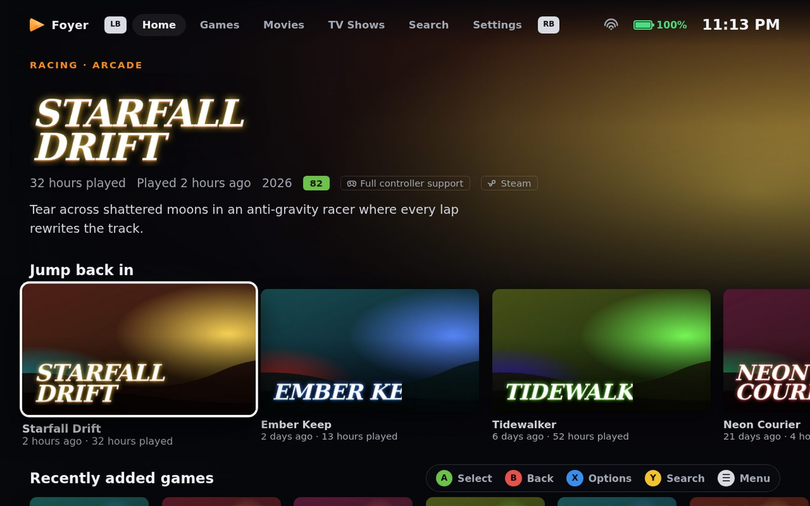
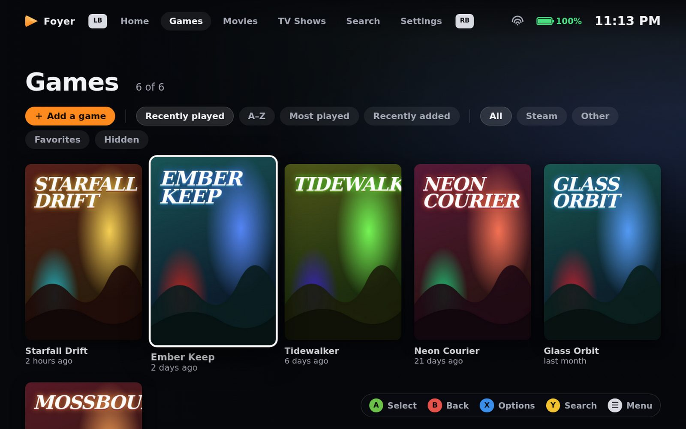
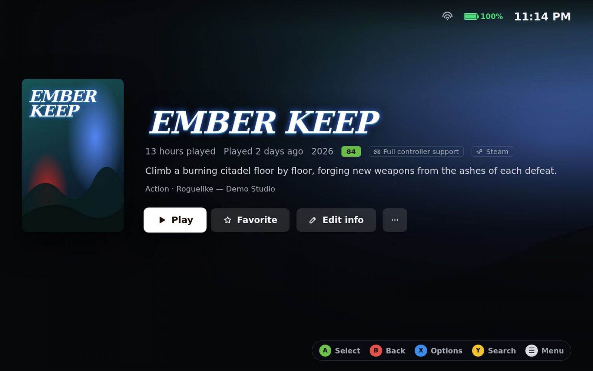
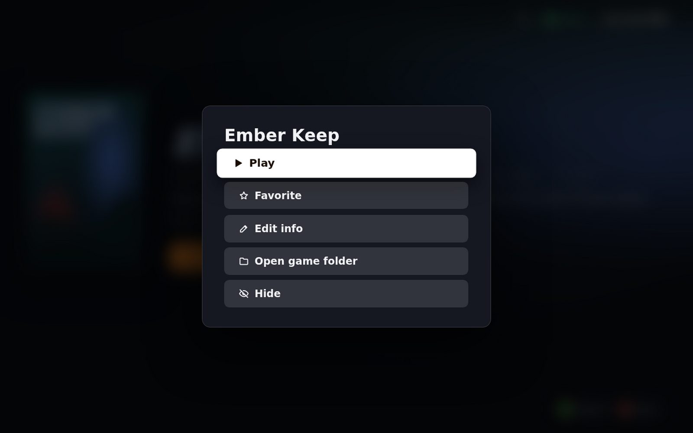

# Foyer

A fullscreen launcher for Windows handhelds and living-room PCs, built for the Lenovo Legion Go. It puts
your **Steam games**, **games you add yourself**, **films** and **TV shows** in one place. You can drive it
with the built-in controller, touch or a keyboard. Films and shows play in **VLC**. Foyer can also be the
**home app of Windows' full screen experience**, so the handheld boots straight into it.

*Foyer* means "home" in French, and the name reads the same in both of the app's languages.



| Games | Game page | Options (X / long-press) |
| --- | --- | --- |
|  |  |  |

## Features

**Games**
- **Steam, automatically.** Every installed Steam game appears with no setup, across all your Steam library
  drives. Covers, backgrounds and logos come from Steam's own cache, including custom artwork you set in
  Steam. Playtime and "last played" come from your Steam account. Games launch through Steam, so the
  overlay, cloud saves and Steam Input keep working.
- **Your own games.** *Add a game* lets you pick any `.exe` (or a `.lnk` / `.url` shortcut) and set launch
  options. This covers emulators, other stores and DRM-free games.
- **Game info.** Descriptions, genres, release dates, Metacritic scores, controller support and screenshots
  come from the Steam store, which needs no account or key. Games you add are matched to their Steam page
  automatically. You can also pick the match yourself with *Edit info → Find info on Steam*.
- **Your choice of artwork.** With a free [SteamGridDB](https://www.steamgriddb.com/profile/preferences/api)
  API key, you can choose covers, backgrounds and logos for any game, Steam or not.
- **Jump back in.** Home puts your most recent games first. Foyer tracks playtime for games you add too.
- **Out of the way while you play.** Once a game is running, Foyer unloads its interface and minimises
  itself. It also drops to low CPU priority and pauses all background work (scans, downloads). When the game
  quits, Foyer comes back to the page you left. The *Free up resources while playing* setting turns this on
  or off.

**Films & TV** (in VLC)
- Movie and TV folders with smart name parsing, including release names and season packs such as
  `Show S02 MULTi 1080p…`.
- Resume, watched tracking, *Continue watching* and *Next up*. Picking an episode queues the rest of the
  series.
- Optional posters and synopses from TMDB.

**Handheld & couch**
- **Controller:** LB / RB switch tabs, LT / RT jump a page, **X** opens options, **Y** opens search and
  **☰** opens the quick menu. On-screen button hints change with context, and light vibration and soft
  sounds confirm your moves (both can be turned off).
- **Touch:** tap anything, swipe rows, long-press for options, swipe in from the left edge to go back. The
  ☰ and ← buttons appear when you touch. Button hints hide automatically when you touch and come back when
  you pick up the controller.
- **Quick menu (☰):** clock, battery, Wi-Fi, volume, brightness, go to desktop, sleep, restart and shut
  down.
- **Status bar:** battery level and charging state, Wi-Fi signal and the clock.
- **Screen size:** laid out for the Legion Go's 8.8" 16:10 screen, and scales up to a TV. The text size is
  adjustable.
- **Language:** English or French, switchable in Settings. Automatic follows Windows. Game descriptions and
  synopses switch language too.

## Install

Download from the [latest release](../../releases/latest), or from the artifacts of the latest
[Build](../../actions/workflows/build.yml) run.

| File | Use it when |
| --- | --- |
| `Foyer-FSE-x.y.z.zip` | **You want Foyer as the full screen experience home app (recommended on a Legion Go).** Extract it and double-click `Install-Foyer-FSE.cmd`. |
| `Foyer-x.y.z-win-x64.zip` | You want no installer: extract it anywhere and run `Foyer.exe`. |
| `Foyer-Setup-x.y.z.exe` | You want a normal install with Start menu shortcuts. |

All three share the same settings and library, which are stored in `%APPDATA%\Foyer`. If you used
Marquee (the previous name), your settings, library and progress are copied over on first launch.

Films and shows need [VLC](https://www.videolan.org/vlc/).

### Full screen experience (home app)

Windows only offers apps as a full screen experience **home app** if they're installed as a package that
declares the `gamingHome` capability. The FSE zip contains Foyer packaged this way, plus an installer. The
approach follows [AnyFSE](https://github.com/ashpynov/AnyFSE). The installer:

1. trusts the package's certificate for app installs,
2. turns on Developer Mode only for the install (Windows requires it for this capability outside the
   Store), then restores your previous setting,
3. installs or updates the package, and
4. offers to set Foyer as the home app.

You can also choose it yourself in **Settings › Gaming › Full screen experience › Home app**. To remove it,
run `Uninstall-Foyer-FSE.ps1`.

The package is signed with a certificate made fresh for each build. Only its public part is published.

## Controls

| Action | Controller | Keyboard | Touch / mouse |
| --- | --- | --- | --- |
| Move | D-pad / left stick | Arrow keys | Tap, swipe / hover |
| Select | A | Enter | Tap / click |
| Back | B | Esc / Backspace | ← button, swipe from left edge |
| Options | X | ContextMenu key | Long-press / right-click |
| Search | Y | `/` | Search tab |
| Previous / next tab | LB / RB | Shift+Tab / Tab | Tap a tab |
| Page up / down | LT / RT | Page Up / Page Down | Scroll |
| Quick menu | ☰ (Menu) | F1 | ☰ button |
| Rescan library | — | F5 | Settings |
| Toggle fullscreen | — | F11 | Settings |

## Development

```sh
npm install
npm start          # run the app
npm test           # unit tests (parsers, Steam scanning, game info, i18n, VLC)
npm run dist       # installer + zip into dist/ (on Windows)
```

```
main.js             Electron main process: window, IPC, view model, VLC & game sessions, suspend while playing
preload.js          The API exposed to the page
src/steam.js        Finds Steam, its library folders, installed games, playtime and cached artwork
src/vdf.js          Parser for Steam's .vdf/.acf files
src/games.js        Launching and tracking games (Steam via RunningAppID, others by process)
src/gameinfo.js     Steam store details, Steam CDN and SteamGridDB artwork, cached on disk
src/system.js       Volume, brightness, Wi-Fi, power and process priority (Windows)
src/library.js      Film & TV folder scanning; src/parse.js name parsing; src/metadata.js TMDB
src/vlc.js          Finding and driving VLC
renderer/           The interface: nav.js (controller/touch/keyboard), core.js, views.js, app.js, i18n.js
build/fse/          MSIX manifest, assets and installer for the full screen experience package
scripts/build-fse.ps1  Builds the FSE package (CI runs it on Windows)
```

CI (`.github/workflows/build.yml`) runs on a Windows runner for every push. It runs the tests, including
one against real VLC, then builds all three downloads. Pushing a tag like `v2.0.0` publishes a release with
them attached.
