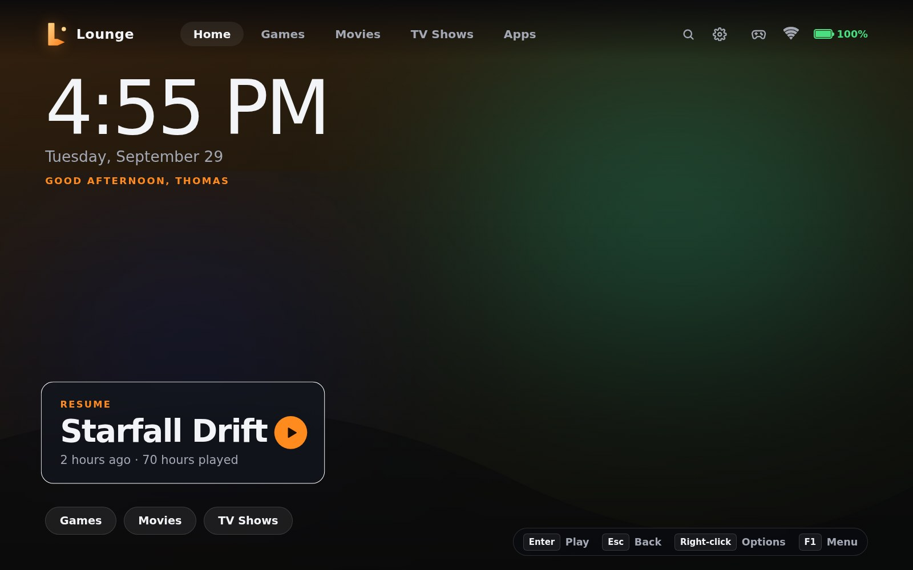
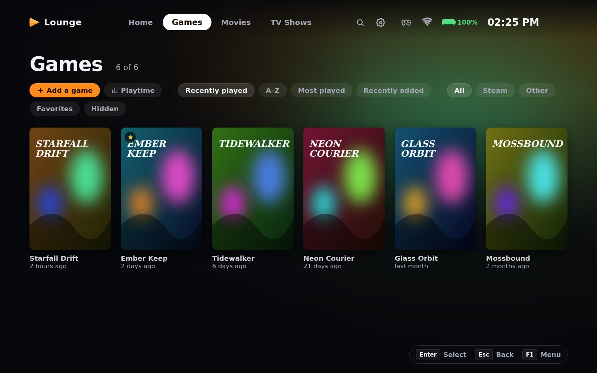
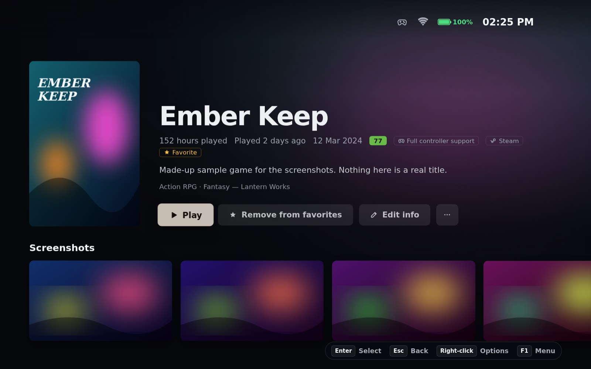
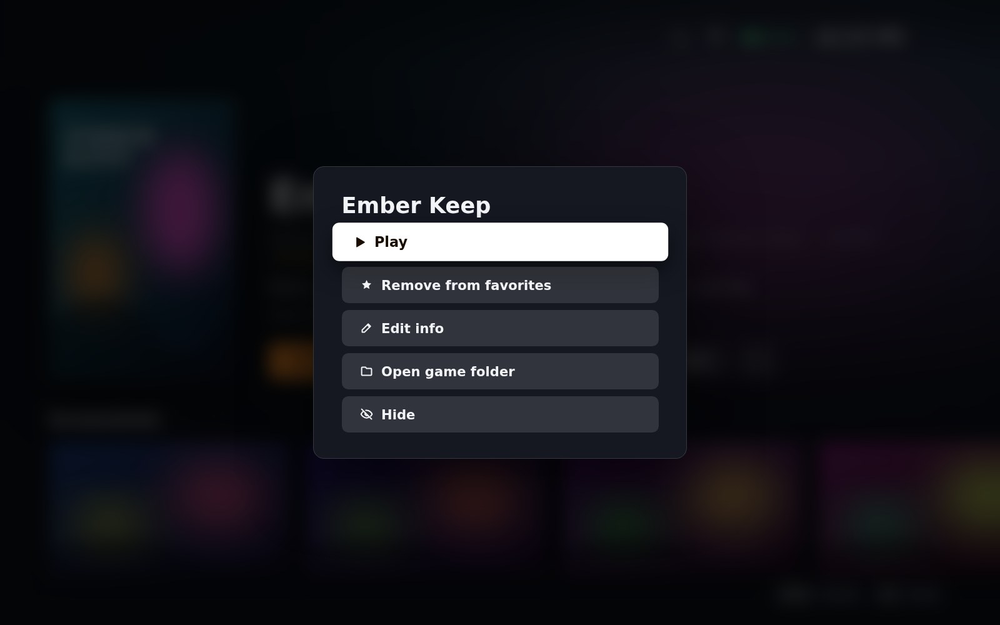

# Lounge

A fullscreen launcher for Windows handhelds and living-room PCs, built for the Lenovo Legion Go. It puts
your **Steam games**, **games you add yourself**, **films** and **TV shows** in one place. You can drive it
with the built-in controller, touch or a keyboard. Films and shows play in **VLC**. Lounge can also be the
**home app of Windows' full screen experience**, so the handheld boots straight into it.

It used to be called Foyer (and before that, Marquee).



| Games | Game page | Options (X / long-press) |
| --- | --- | --- |
|  |  |  |

## Features

**Games**
- **Steam, automatically.** Every installed Steam game appears with no setup, across all your Steam library
  drives. Covers, backgrounds and logos come from Steam's own cache, including custom artwork you set in
  Steam. Playtime and "last played" come from your Steam account. Games launch through Steam, so the
  overlay, cloud saves and Steam Input keep working.
- **Your own games.** *Add a game* lets you pick any `.exe` (or a `.lnk` / `.url` shortcut) and set launch
  options. This covers emulators, other stores and DRM-free games.
- **Game info.** Descriptions, genres, release dates, Metacritic scores, controller support and screenshots
  come from the Steam store, which needs no account or key. Games you add are matched to their Steam page
  automatically. You can also pick the match yourself with *Edit info → Find info on Steam*.
- **Your choice of artwork.** With a free [SteamGridDB](https://www.steamgriddb.com/profile/preferences/api)
  API key, you can choose covers, backgrounds and logos for any game, Steam or not.
- **Jump back in.** Home puts your most recent games first. Lounge tracks playtime for games you add too.
- **Out of the way while you play.** Once a game is running, Lounge unloads its interface and minimises
  itself. It also drops to low CPU priority and pauses all background work (scans, downloads). When the game
  quits, Lounge comes back to the page you left. The *Free up resources while playing* setting turns this on
  or off.

**Films & TV** (in VLC)
- Movie and TV folders with smart name parsing, including release names and season packs such as
  `Show S02 MULTi 1080p…`.
- Resume, watched tracking, *Continue watching* and *Next up*. Picking an episode queues the rest of the
  series.
- Optional posters and synopses from TMDB.

**Handheld & couch**
- **Controller:** LB / RB switch tabs, LT / RT jump a page, **X** opens options, **Y** opens search and
  **☰** opens the quick menu. On-screen button hints change with context, and light vibration and soft
  sounds confirm your moves (both can be turned off).
- **Touch:** tap anything, swipe rows, long-press for options, swipe in from the left edge to go back. The
  ☰ and ← buttons appear when you touch. Button hints hide automatically when you touch and come back when
  you pick up the controller.
- **Quick menu (☰):** clock, battery, Wi-Fi, volume, brightness, go to desktop, sleep, restart and shut
  down.
- **Status bar:** battery level and charging state, Wi-Fi signal and the clock.
- **Screen size:** laid out for the Legion Go's 8.8" 16:10 screen, and scales up to a TV. The text size is
  adjustable.
- **Motion:** opening a card morphs its artwork into the detail page, the tab highlight slides, rows fade
  in one after another, focus has a spring to it, the backdrop drifts slowly with a touch of depth, and
  artwork fades in over a loading shimmer. *Settings › Animations › Reduced* calms it all down and saves a
  little battery. Windows' own "reduce motion" setting is respected too.
- **Language:** English or French, switchable in Settings. Automatic follows Windows. Game descriptions and
  synopses switch language too.

## Install

Download from the [latest release](../../releases/latest), or from the artifacts of the latest
[Build](../../actions/workflows/build.yml) run.

| File | Use it when |
| --- | --- |
| `Lounge-FSE-x.y.z.zip` | **You want Lounge as the full screen experience home app (recommended on a Legion Go).** Extract it and double-click `Install-Lounge-FSE.cmd`. |
| `Lounge-x.y.z-win-x64.zip` | You want no installer: extract it anywhere and run `Lounge.exe`. |
| `Lounge-Setup-x.y.z.exe` | You want a normal install with Start menu shortcuts. |

All three share the same settings and library, which are stored in `%APPDATA%\Lounge`. If you used
Foyer or Marquee (the previous names), your settings, library, progress and stats are copied over on first
launch. A copy installed as Foyer 2.0.0 looks for updates under the old name, so install this version once by
hand; it updates itself from then on. Installers and the FSE package upgrade the Foyer install in place.

Films and shows need [VLC](https://www.videolan.org/vlc/).

### Updates

Lounge checks GitHub Releases when it starts and every few hours after that. It never installs anything
without asking. When a new version is out, you get **Update now / Later / Skip this version**. It doesn't
ask, download or install while a game is running. The download is checked against the SHA-256 checksum
GitHub publishes for each file. Lounge then updates itself using the method that matches how it was
installed, and restarts:

| Installed with | Update method |
| --- | --- |
| Installer (`Lounge-Setup`) | Runs the new installer silently over the old one. |
| Zip | Unpacks the new version over the folder once Lounge has closed (asks for admin only if the folder needs it). |
| FSE package | Runs the package's installer in update mode: one admin prompt; your home-app choice is kept. |

*Settings › Updates* shows your version and has *Check for updates*. You can also turn automatic checking
off there.

### Full screen experience (home app)

Windows only offers apps as a full screen experience **home app** if they're installed as a package that
declares the `gamingHome` capability. The FSE zip contains Lounge packaged this way, plus an installer. The
approach follows [AnyFSE](https://github.com/ashpynov/AnyFSE). The installer:

1. trusts the package's certificate for app installs,
2. turns on Developer Mode only for the install (Windows requires it for this capability outside the
   Store), then restores your previous setting,
3. installs or updates the package, and
4. offers to set Lounge as the home app.

You can also choose it yourself in **Settings › Gaming › Full screen experience › Home app**. To remove it,
run `Uninstall-Lounge-FSE.ps1`.

The package is signed with a certificate made fresh for each build. Only its public part is published.

## Controls

| Action | Controller | Keyboard | Touch / mouse |
| --- | --- | --- | --- |
| Move | D-pad / left stick | Arrow keys | Tap, swipe / hover |
| Select | A | Enter | Tap / click |
| Back | B | Esc / Backspace | ← button, swipe from left edge |
| Options | X | ContextMenu key | Long-press / right-click |
| Search | Y | `/` | Search tab |
| Previous / next tab | LB / RB | Shift+Tab / Tab | Tap a tab |
| Page up / down | LT / RT | Page Up / Page Down | Scroll |
| Quick menu | ☰ (Menu) | F1 | ☰ button |
| Rescan library | — | F5 | Settings |
| Toggle fullscreen | — | F11 | Settings |

## Development

Lounge is Rust: the interface is drawn natively with [Slint](https://slint.dev) (Skia renderer).

```sh
cargo run -p lounge -- --demo        # a made-up library in a window (any OS)
cargo test -p lounge-core -p lounge  # unit tests
cargo build --release -p lounge      # target/release/lounge(.exe), self-contained
scripts/snap.sh "go games; shot snaps/games.png"   # headless screenshots of the demo (Linux, Xvfb)
```

```
lounge-core/        Business logic, no UI: Steam (steam.rs, vdf.rs), games, game info, film & TV
                    libraries (library.rs, parse.rs, metadata.rs), VLC, remote servers and transfers,
                    system controls, the updater
app/src/backend/    Application state and every command; emits events to the UI
app/src/ui/         The Slint side in Rust: context, router, dialogs, artwork, input, one module per screen
app/ui/             The .slint files (theme, widgets, shell, pages/, overlays/)
app/i18n/           UI strings (en, fr)
app/src/demo.rs     The demo library used by --demo and the screenshots
build/nsis/         The installer script (per-user; the updater runs it silently)
build/fse/          MSIX manifest, assets and installer for the full screen experience package
scripts/build-fse.ps1  Builds the FSE package (CI runs it on Windows)
```

`app/UI.md` is the guide to the interface code: data flow, focus and keys, strings, dialogs, screenshots.

CI (`.github/workflows/build.yml`) runs for every push. On Windows it runs the tests and clippy, then builds
the zip, the installer and the full screen experience package; on Linux it builds the app and photographs
every screen of the demo. Pushing a tag like `v3.0.0` publishes a release with the downloads attached.
